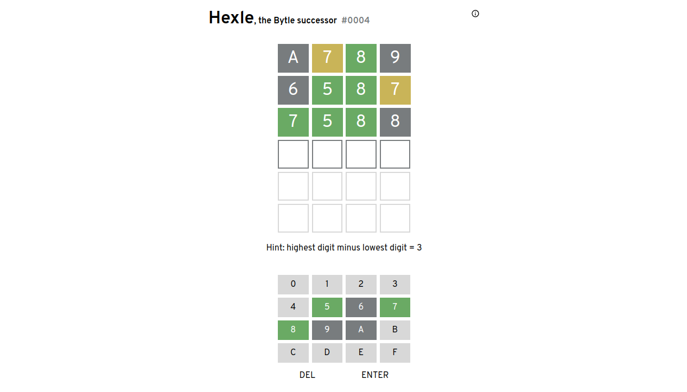

# [Hexle](https://jamesl.me/hexle)
A [Wordle](https://www.powerlanguage.co.uk/wordle/)-like game where you have to guess the unsigned 16-bit number in hexadecimal! It's an iteration of my previous (less fun) game called [Bytle](https://jamesl.me/bytle/).

